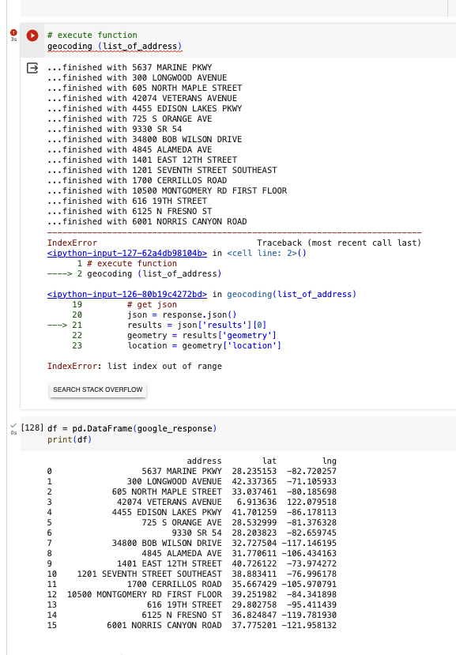
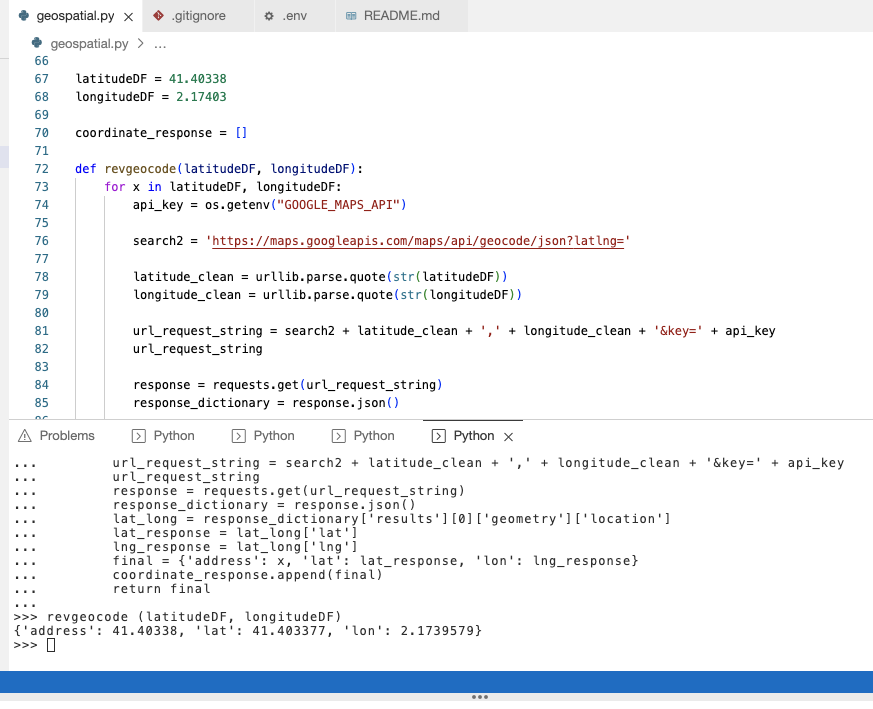
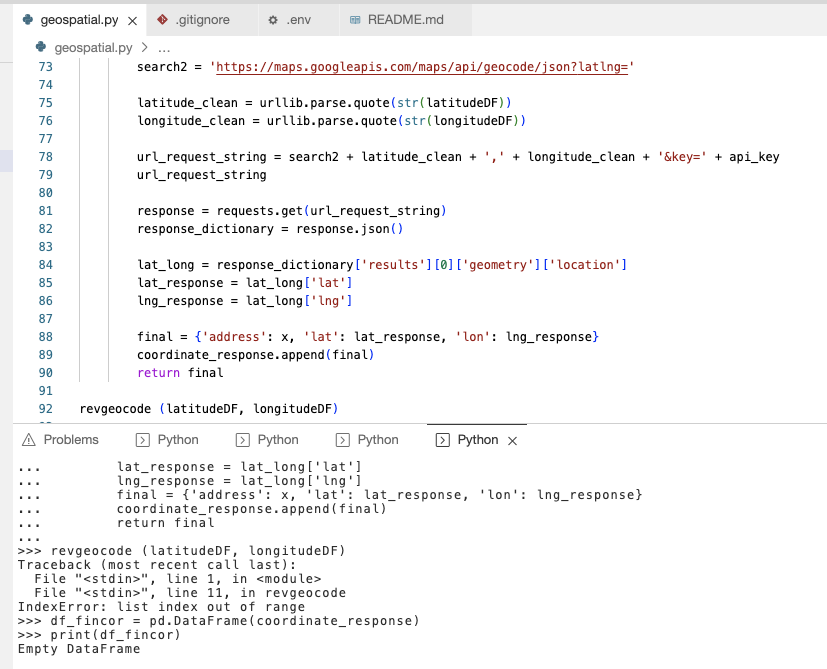

# datasci_7_geospatial

# Challenges

1. Geocoding function correctly runs addressess and returns coordinates until a particular address triggers and error message:
   

2. Reverse geocoding function does not work to pull in address
   

3. Reverse geocoding function error indicating index error
   
